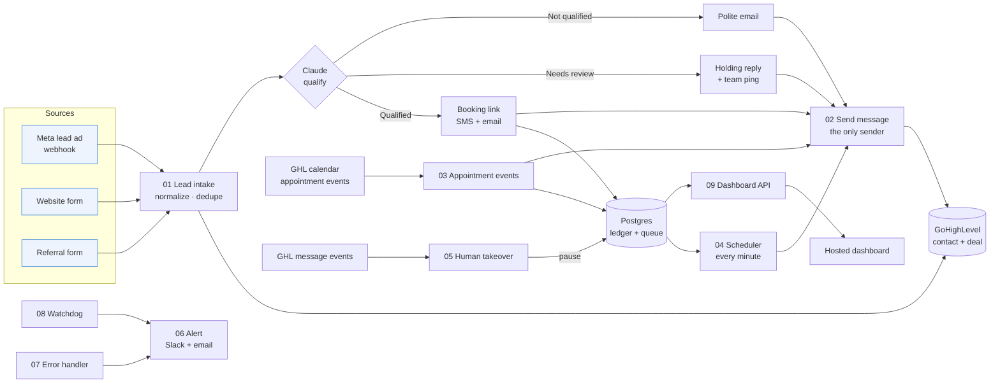

# Speed-to-Lead Revenue Engine

*n8n + GoHighLevel + Claude*

A B2B agency (Northwind Growth, the example client) gets leads from Meta ads, its
website and referrals. Before this system, replies took hours, about half of booked calls
no-showed, and nobody knew what a booked call cost. With it, every lead gets a reply in about
a minute. Claude qualifies each lead, qualified leads get a booking link, and the system
reminds and chases them. The owner gets a one-screen scorecard showing which source brings
the cheapest booked calls.

| Deliverable | Where |
|---|---|
| n8n workflows (exported JSON) | [`workflows/`](workflows/) (9 files, import in n8n) |
| Live dashboard | GitHub Pages: `https://sirineghader-dotcom.github.io/sirine-portfolio/speed-to-lead/dashboard/` |
| Ad spend sheet | [`data/ad-spend.csv`](data/ad-spend.csv) |
| Database schema | [`sql/schema.sql`](sql/schema.sql) |
| Proof the guarantees hold | [`scripts/test_guarantees.py`](scripts/test_guarantees.py) (23 checks against real Postgres) |
| Test-lead simulator (for the Loom) | [`scripts/simulate.sh`](scripts/simulate.sh) |
| Loom script | [below](#loom-script), with diagrams in [`diagram.html`](diagram.html) |

---

## How it works



GoHighLevel is the CRM the team works in. A small Postgres database holds the
system's memory, and that is what makes the hard guarantees hold.

| Workflow | What it does |
|---|---|
| `01-lead-intake` | Three webhooks (Meta, website, referral), each tagged with its source. Normalizes the data, dedupes, creates the GHL contact and deal, asks Claude to qualify, moves the deal and sends the first reply. Also schedules the booking chase. |
| `02-send-message` | Sub-workflow and the **only** place that messages a lead. Reserves the send in a ledger first, refuses if a human has taken over, then calls GHL. |
| `03-appointment-events` | GHL calendar events. Works out whether each one is a booking, reschedule, cancellation, no-show or show; moves the deal; kills old reminders; queues new ones. |
| `04-scheduler` | Every minute: claims due reminders, chases and re-books, re-checks each one is still valid, then sends it. |
| `05-human-takeover` | GHL message events. A message from a team member pauses all automation for that lead. A STOP reply does the same. Any other lead reply pings the team. |
| `06-alert` | Sub-workflow: records the alert, then posts to Slack and sends an email. |
| `07-error-handler` | n8n error workflow for every other workflow: any crash becomes an alert. |
| `08-watchdog` | Every 5 minutes: finds problems that never threw an error (a lead with no reply after 5 min, a stalled scheduler, a send GHL never confirmed, a review waiting over 2 hours). Pings a dead-man's switch. |
| `09-dashboard-api` | Anonymised per-source data (no names or emails) for the dashboard. |

---

## The real work, and how each case is handled

### 1. The same event can arrive 3 times, and nobody gets the same message twice

Two independent locks:

- **Event gate.** Every webhook gets a deterministic key: the Meta `leadgen_id`, the form
  submission id, or `appointmentId + status + startTime`. The first step inserts that key
  into `processed_events` with `INSERT … ON CONFLICT DO NOTHING`. Postgres guarantees exactly
  one execution gets `is_new = true`, even when the 3 copies arrive in the same millisecond.
  The copies are counted (`hits`) and stop.
- **Send ledger.** Every message has a dedupe key (`lead:template`, or
  `appointment:version:template`). `02-send-message` reserves that key in `sent_messages`
  *before* it calls GHL, so a second attempt cannot send. If GHL errors, the message is not
  retried automatically, because GHL may have sent it before timing out. Instead the team
  gets an alert.
- Webhooks answer `200` immediately, so Meta and GHL have no reason to retry.

### 2. A reschedule or cancel kills the old reminders

- Each appointment has a `version` that goes up whenever its start time changes. Reminders
  are queued as rows tied to `(appointment_id, version)`.
- A reschedule or cancel marks every pending reminder for that lead as `cancelled`, then
  queues new ones for the new version.
- Right before sending, the scheduler checks again that the row's version is still current
  and the appointment is still booked. A reminder for the old time cannot go out, even if
  it was mid-flight during the reschedule.
- An event older than the last one applied is ignored, so out-of-order webhooks are safe.

### 3. A human reply stops all automation for that lead

- GHL reports every outbound message. Our own sends are in the ledger with GHL's message
  id; anything else is a person, so the workflow sets `automation_paused` on the lead,
  cancels the queue, tags the contact `human-takeover` and tells the team.
- Every send re-checks the pause inside the same SQL statement that reserves it, so nothing
  queued earlier can slip out.
- A reply of STOP (or unsubscribe, end, quit) pauses the lead the same way.

### 4. Every failure alerts you. No silent errors

- **Crashes:** every workflow names `07-error-handler` as its error workflow, which posts
  to Slack and sends an email with a link to the failed execution.
- **Soft failures:** a failed Claude call parks the lead in Needs Review and still sends a
  reply, then alerts. If GHL refuses a message, the ledger records it and an alert goes out.
  A lead without an email or phone also triggers an alert.
- **Silent failures:** the watchdog alerts when a lead has had no reply after 5 minutes,
  when sends are overdue (the scheduler is down), and when a send is stuck. Each problem
  alerts once, not every 5 minutes.
- **n8n itself down:** the watchdog pings a Healthchecks.io check every 5 minutes. If the
  pings stop, Healthchecks emails you.
- Alert targets are written into the Alert workflow itself, so alerts still go out when
  the database is down.

Run `python3 scripts/test_guarantees.py` to see all of this pass against real Postgres,
using the SQL read straight out of the workflow files:

```
PASS same lead event x3 is processed once  [is_new=[True, False, False], hits=3]
PASS 3 simultaneous copies: exactly one wins
PASS first reply reserved once out of 3 attempts
PASS booking event x3 handled once
PASS reschedule kills old reminders, queues new ones
PASS out-of-order old event is ignored
PASS scheduler refuses reminders for the old time
PASS after takeover, even a brand-new message is refused
PASS watchdog flags a lead with no reply after 5 min
PASS the same alert is delivered once, not every 5 minutes
...
23/23 guarantees hold
```

---

## My calls

### Ideal client and qualification rules

The ideal client is a **B2B** company (services, SaaS, professional services) with
**10 to 200 employees**. It spends **$5,000 or more a month** on marketing, the person
filling in the form is a **decision maker**, and it wants to start within **90 days**.

Claude (`claude-opus-5-5`, low effort, JSON-schema output) scores each lead from 0 to 100
on five weighted factors: business model fit 30, size 20, budget 25, authority 15 and
timeline 10. It returns a label, the score and a one-line reason. The full rules are in
[`prompts/qualification-system-prompt.md`](prompts/qualification-system-prompt.md).

| Result | Rule | What happens |
|---|---|---|
| Qualified | score ≥ 70, no disqualifier | booking link by SMS and email within ~1 min, chase at +4h, +1d, +3d |
| Needs review | 40 to 69, budget $2k to $5k, 500+ staff, missing or odd answers, or AI unavailable | short holding reply, team pinged, watchdog nags after 2h |
| Not qualified | score < 40, or B2C, job seeker, vendor, budget under $2k | one polite email, deal marked lost |

Code then enforces the rules after Claude answers. A "qualified" label with a score under
70 is downgraded to Needs Review. Form answers are passed as data, so text in a form field
can't change the rules.

### Channels and timings

| Moment | Channel | Timing |
|---|---|---|
| First reply | SMS (fast) + email (has the link) | within ~1 minute of opt-in |
| Booking chase | SMS, email, SMS | +4 hours, +1 day, +3 days. Stops when booked |
| Booking confirmed / rescheduled | SMS + email | immediately |
| Reminders | email + SMS, then SMS | 24 hours and 2 hours before the call |
| Cancelled | SMS, then email | immediately, then +2 days |
| No-show re-book | SMS, email, SMS | +15 minutes, +1 day, +3 days. Stops when re-booked |

The booking tool is the GHL calendar, so appointment events arrive natively. All copy lives
in one place (the `Render template` node in `02-send-message`).

### Pipeline stages (GHL)

New Lead → Needs Review → Qualified – Link Sent → Call Booked → Call Rescheduled →
Showed. The side stages are Not Qualified, Call Cancelled and No-Show – Re-book.

---

## Dashboard

[`dashboard/index.html`](dashboard/index.html) is a static page hosted on GitHub Pages, not
in GHL. It opens with one sentence answering the owner's question: which source brings the
cheapest booked calls, and at what price. Below that is one card per source, ranked. Every
number belongs to one source; nothing is blended.

- Leads → Qualified → Booked → Showed, per source
- Minutes from opt-in to first reply (median, 90th percentile, % within 5 min)
- Cost per lead, per booked call and per show, using spend from the ad spend sheet
- No-show rate, plus a rolling cost-per-booked-call trend and the full spend sheet

By default it shows demo data generated by `scripts/generate_demo_data.py`: 681 simulated
leads from Jul 1 to Oct 9, 2026, plus the spend sheet. To show live numbers, set
`LIVE_API_URL` in the page to the `09-dashboard-api` webhook, or open the page with
`?api=https://<n8n>/webhook/stl/dashboard`.

### The ad spend sheet

[`data/ad-spend.csv`](data/ad-spend.csv) has one row per day, per source and per line item.
Monthly costs are spread across the days of the month, so any date range adds up correctly.

| Source | Line items |
|---|---|
| Meta | Lead form campaigns, $150 to $195/day with weekend dips and a budget bump after a September creative refresh. Creative production, $900/month |
| Website | Google Ads B2B search, about $70/weekday. SEO and content retainer, $1,800/month. Landing page tools, $149/month |
| Referral | Partner program, $450/month. Referral bonus of $200, paid when a referred lead shows up |

---

## Setup

1. **Postgres:** run `sql/schema.sql` (Supabase, Neon or any Postgres 13+), then fill the
   `settings` table with your GHL IDs and booking link. To load the spend sheet, run
   `\copy ad_spend (date, source, line_item, amount_usd) FROM 'data/ad-spend.csv' CSV HEADER`.
2. **GoHighLevel:**
   - Create the pipeline stages above.
   - Create the custom fields `lead_score`, `qualification`, `qualification_reason` and `lead_source`.
   - Create a Private Integration token with the contacts, opportunities, conversations and
     calendars scopes.
   - Point the appointment and message webhooks (marketplace app, or workflow Webhook
     actions) at `/webhook/stl/appointment` and `/webhook/stl/message`.
3. **n8n credentials:**
   - `STL Postgres`
   - `GHL Private Integration`: Header Auth, `Authorization: Bearer <token>`
   - `Anthropic API`: Header Auth, `x-api-key: <key>`
   - `Alerts SMTP`
4. **Import:** run `N8N_URL=… N8N_API_KEY=… python3 scripts/deploy_to_n8n.py`. It creates
   all 9 workflows and wires the sub-workflow and error-workflow IDs. Select the credentials
   once, then run again with `--activate`. To import by hand instead, upload each JSON file,
   then pick the sub-workflow in each "Execute Workflow" node and the error workflow in
   Settings.
5. **Alerts:** set the Slack webhook in `06-alert` → `Alert targets`, the email addresses in
   its `Email` node, and your Healthchecks.io URL in `08-watchdog`.
6. **Meta:** point the Lead Ads webhook at `/webhook/stl/lead/meta` (the GET handshake is
   handled). No ad account is needed to test: `scripts/simulate.sh` sends Meta-shaped data.

The workflow JSON is generated from `scripts/build_workflows.py`, so edit that and run it
again rather than hand-editing the JSON.

---

## Loom script

About 8 minutes. Set `export N8N=https://<your-n8n>/webhook` first, with GHL, n8n
executions and Slack open side by side.

**Part 1: one lead from opt-in to booked call (3 min)**

1. Start on the dashboard. "The owner's question is answered in the first sentence:
   referrals bring the cheapest booked calls at $243. Meta has the cheapest leads, but 43%
   of its calls no-show, so each show costs $577."
2. Run `./simulate.sh meta`. Show the n8n execution: the webhook, normalize, dedupe, GHL
   contact tagged `source-meta`, and the deal in New Lead. Then Claude returns
   `qualified · 86 · "B2B SaaS, 25-50 staff, $8-15k/mo, founder, starting this month."`
3. Show the phone or the GHL conversation: the SMS and email with the booking link, about
   60 seconds after opt-in. Show the deal in *Qualified – Link Sent* and the score fields on
   the contact.
4. Book a slot through the booking link. Show the deal move to *Call Booked*, the
   confirmation SMS, and 3 reminder rows queued (24h email, 24h SMS, 2h SMS). The booking
   chase rows are now cancelled.
5. Quickly show the other two outcomes: `./simulate.sh website` gives Needs Review, a
   holding reply and a Slack ping. `./simulate.sh referral` (a nail salon) gives Not
   Qualified and one polite email.

**Part 2: the real work (5 min)**

1. **Duplicates:** run `./simulate.sh dupes`. Show 3 executions: one runs the flow, two stop
   at "Duplicate: stop here". In `processed_events` the row shows `hits = 3`, and only one
   SMS arrives.
2. **Reschedule:** move the appointment in GHL (or run `./simulate.sh reschedule …`). The
   deal moves to *Call Rescheduled*, and the old reminders show `cancelled`, "rescheduled,
   old reminders killed". New reminders appear with version 2.
3. **Cancel and no-show:** run `cancel`. The deal moves to *Call Cancelled* and the re-book
   SMS goes out. Then run `noshow`. The deal moves to *No-Show – Re-book* and the 3-step
   re-book sequence is queued.
4. **Human reply:** reply by hand from GHL (or `./simulate.sh human <contactId>`). Slack
   shows "Automation is now OFF for this lead". The contact gets the `human-takeover` tag and
   pending messages go to `cancelled`. Re-run a booking event: the reminders are queued but
   skipped with "automation paused".
5. **Failures:** run `./simulate.sh broken` for an instant alert. Then deactivate the
   scheduler and show the watchdog's "messages are overdue" alert. Break the Anthropic key
   and show the lead still getting a holding reply, plus an "AI failed" alert.
6. End on `python3 scripts/test_guarantees.py`: 23/23 guarantees hold.
